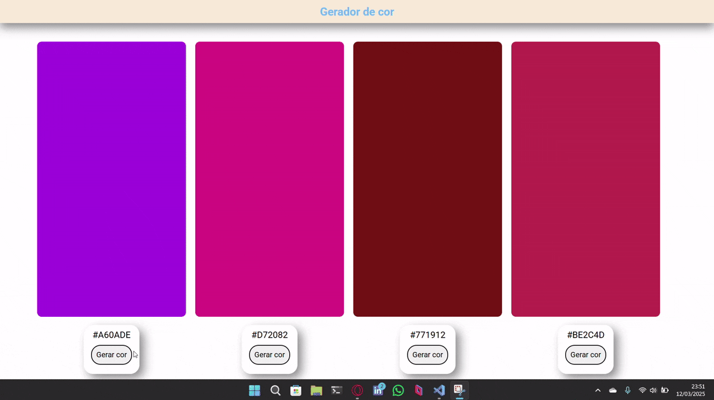

<h1>
    
    Gerador Hexadecimal
</h1>
 
<h2>
    
    Objetivo
</h2>

Este projeto consiste na criação de um gerador de cores hexadeciamais.

O foco é aprender sobre geração de valores aleatórios em Javascript, além de aplicar manipulações no DOM.

 
<h2>
    
    Como funciona
</h2>
<ol>
    <li>
A geração do hexadecimal é feita através de um vetor com números (de 0 a 9) e letras de (A a F).
</li>
    <li>
O índice do vetor é pego aleatóriamente com o uso de <code>Math.floor()</code> e <code>Math.random()</code>.
</li>
    <li>
Um loop pega o valor do vetor 6 vezes e os armazena, gerando o hexadecimal.
</li>
    <li>
Depois disso, é realizado uma manipulação do DOM, onde acessa a cor de fundo de uma div e insere o hexadecimal como novo valor.
</li>
</ol>
 
<h2>
    
    Função de cada linguagem
</h2>
<ul>
    <li><b>HTML:</b> estrutar o site.</li>
    <li><b>CSS:</b> estilizar o site e definir as classes para manipular o DOM.</li>
    <li><b>JS:</b> gerar o hexadecimal e manipular o DOM, inserindo os valores gerados.</li>
</ul>

