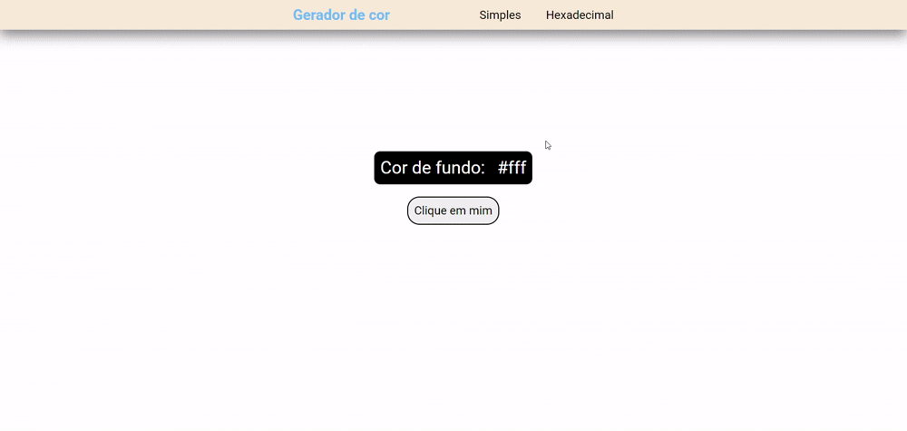

<h1>Gerador Hexadecimal</h1>

Este projeto consistem em um gerador de cores simples e um gerador de cores hexadeciamais.

O foco deste projeto é aprender sobre geração de valores aleatórios em Javascript, além de aplicar manipulações no DOM.

O gerador de hexadecimal pega um número ou letra de um vetor de forma aleatória até formar uma string de um hexadecimal de 6 caracteres, e depois os insere como uma nova cor de fundo.

